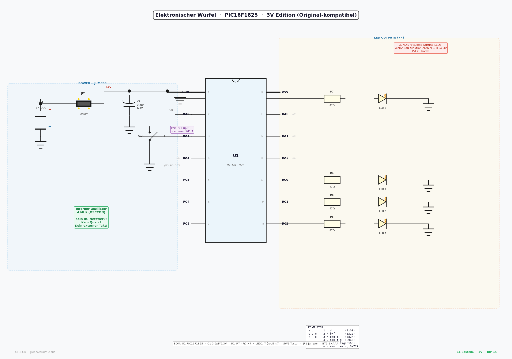

# 🎲 Elektronischer Würfel — PIC Mikrocontroller

**Minimalistischer Hardware-Würfel mit Auto-Sleep-Funktion**

Dieses Projekt implementiert einen elektronischen Würfel mit PIC-Mikrocontrollern. Zwei Versionen verfügbar: **PIC16F84A** (klassisch) und **PIC16F1825** (modern, 3V-kompatibel mit Auto-Sleep).

[](https://opensource.org/licenses/MIT)
[](https://www.microchip.com/wwwproducts/en/PIC16F84A)
[](https://www.microchip.com/wwwproducts/en/PIC16F1825)

---

## 📋 Inhaltsverzeichnis

- [Features](#-features)
- [Hardware-Versionen](#-hardware-versionen)
- [Schaltplan](#-schaltplan)
- [Pin-Belegung](#-pin-belegung)
- [Installation](#-installation)
- [Kompilieren](#-kompilieren)
- [Flashen](#-flashen)
- [Stromverbrauch](#-stromverbrauch)
- [LED-Muster](#-led-muster)
- [Auto-Sleep (PIC16F1825)](#-auto-sleep-pic16f1825)
- [Support](#-support)
- [Lizenz](#-lizenz)

---

## ✨ Features

- ✅ **7 LEDs** in Würfel-Anordnung (⚀ bis ⚅)
- ✅ **Würfel-Animation** (schnell → langsam, physikalisch)
- ✅ **3× Blinken** am Ende als Feedback
- ✅ **Pseudo-Zufallsgenerator** via Timer0 + Benutzer-Reaktionszeit
- ✅ **Startup-Animation** (zeigt alle 6 Seiten beim Einschalten)
- ✅ **Auto-Sleep nach 10 Sekunden** (nur PIC16F1825)
- ✅ **Wake-on-Button** mit Anzeige der letzten Zahl
- ✅ **Batteriebetrieb**: 2×AAA (3V) oder 3×AA (4,5V)
- ✅ **Monatelange Batterielaufzeit** dank Sleep-Modus

---

## 🛠️ Hardware-Versionen

### Version 1: PIC16F84A (Klassisch)

- **Gehäuse:** DIP-18
- **Versorgung:** 3×AA (4,5V) oder via 7805 Regler
- **Oszillator:** Extern (RC-Modus mit 4,7kΩ + 100pF)
- **Bauteile:** 14 Stück
- **Besonderheiten:** MCLR-Pullup erforderlich, kein Sleep-Modus

📄 **Code:** `main.c`  
📄 **Dokumentation:** [README.md](README.md) (dieser File)  
🔌 **Schaltplan:** `schematic_pic16f84_v2.png`

### Version 2: PIC16F1825 (Modern, empfohlen!)

- **Gehäuse:** DIP-14
- **Versorgung:** 2×AAA (3V) — Original-kompatibel!
- **Oszillator:** Intern (4 MHz, kein RC-Netzwerk!)
- **Bauteile:** **11 Stück** — absolutes Minimum!
- **Besonderheiten:** Auto-Sleep (~1µA), MCLRE=OFF, interner Pull-Up

📄 **Code:** `main_1825.c`  
📄 **Dokumentation:** [README_1825.md](README_1825.md)  
🔌 **Schaltplan:** `schematic_1825_3v.png`

---

## 🔌 Schaltplan

### PIC16F1825 @ 3V (empfohlen)



**Minimale Stückliste (11 Bauteile):**

| Ref     | Wert         | Beschreibung                        |
|---------|--------------|-------------------------------------|
| U1      | PIC16F1825   | Mikrocontroller, DIP-14             |
| C1      | 3,3 µF/6,3V  | VDD-Bypass, Elko                    |
| LED1–7  | Rot/Gelb     | ⚠️ NUR Vf<2,1V (kein Weiß/Blau!)   |
| R1–R7   | 47 Ω         | LED-Vorwiderstände @ 3V             |
| SW1     | Drucktaster  | Würfel-Button                       |
| JP1     | 2-Pin Jumper | Power On/Off                        |
| BT1     | 2× AAA       | 3V Versorgung                       |

⚠️ **Wichtig:** Bei 3V funktionieren nur **rote, gelbe oder grüne LEDs**! Weiße und blaue LEDs haben eine zu hohe Durchlassspannung (Vf > 3V).

---

## 📌 Pin-Belegung

### PIC16F1825 (DIP-14)

```
         ┌────────────────┐
  VDD  1─┤                ├─14 VSS (GND)
  RA5  2─┤  PIC16F1825    ├─13 RA0 (N/C)
  RA4  3─┤   (DIP-14)     ├─12 RA1 (N/C)
  RA3  4─┤  MCLR=OFF      ├─11 RA2 (N/C)
  RC5  5─┤                ├─10 RC0 → LED a
  RC4  6─┤                ├─ 9 RC1 → LED b
  RC3  7─┤                ├─ 8 RC2 → LED c
         └────────────────┘

Pin-Zuordnung:
  RC0 → LED a (oben-links)       RC3 → LED d (Zentrum)
  RC1 → LED b (oben-rechts)      RC4 → LED e (mitte-rechts)
  RC2 → LED c (mitte-links)      RC5 → LED f (unten-links)
  RA5 → LED g (unten-rechts)
  RA4 ← Taster (interner Pull-Up via WPUA, kein externer Widerstand!)
```

### PIC16F84A (DIP-18)

📄 Siehe [README.md](README.md) und `schematic_pic16f84_v2.png`

---

## 🔨 Installation

### Voraussetzungen

- **MPLAB X IDE** (Version 5.x oder höher)
- **XC8 Compiler** (v2.x)
- **PICkit 3/4** oder anderer PIC-Programmer
- **Hardware** (siehe Stückliste oben)

### Software-Installation

```bash
# Repository klonen
git clone https://github.com/RaithChr/Dice-PIC16F84A.git
cd Dice-PIC16F84A
```

---

## ⚙️ Kompilieren

### MPLAB X IDE

1. **Neues Projekt erstellen:**
   - File → New Project → Microchip Embedded → Standalone Project
   - Device: `PIC16F1825` (oder `PIC16F84A`)
   - Tool: PICkit 3/4
   - Compiler: XC8

2. **Code hinzufügen:**
   - `main_1825.c` für PIC16F1825
   - `main.c` für PIC16F84A

3. **Build-Einstellungen:**
   - Optimization Level: **1** oder **s** (size)
   - Build → Clean and Build

4. **Hex-File erzeugen:**
   - Output: `dist/default/production/dice.production.hex`

### Kommandozeile (XC8)

```bash
xc8-cc -mcpu=16F1825 -Wl,-Map=output.map -o output.hex main_1825.c
```

---

## 📥 Flashen

### PICkit 3/4

```bash
# Via MPLAB IPE
1. Select Device: PIC16F1825
2. Load Hex: dist/.../dice.production.hex
3. Program
```

### ICSP Pin-Belegung (PIC16F1825)

```
PICkit 3/4           PIC16F1825
─────────────────────────────────
1 (MCLR/VPP)    →    RA3 (Pin 4)
2 (VDD)         →    VDD (Pin 1)
3 (VSS)         →    VSS (Pin 14)
4 (PGD)         →    RA0 (Pin 13)
5 (PGC)         →    RA1 (Pin 12)
```

⚠️ **Wichtig:** Bei aktivem Betrieb LEDs an RA0/RA1 **vor dem Programmieren trennen** (bzw. Jumper ziehen)!

---

## 🔋 Stromverbrauch

### PIC16F1825 @ 3V (mit Auto-Sleep)

| Zustand            | Strom    | Bemerkung                          |
|--------------------|----------|------------------------------------|
| Aktiv (6 LEDs)     | ~48 mA   | Würfelzahl angezeigt               |
| Sleep-Modus        | ~1 µA    | Nach 10 Sekunden Inaktivität       |
| Normal (10×/Tag)   | ~15 µAh  | Durchschnitt                       |

**Batterie-Laufzeit (2×AAA, 1200 mAh):**
- Dauerbetrieb (LEDs immer an): ~25 Stunden
- **Normal (Auto-Sleep):** mehrere **MONATE** 🎯

### PIC16F84A @ 4,5V (ohne Sleep)

| Zustand            | Strom    | Bemerkung                          |
|--------------------|----------|------------------------------------|
| Aktiv (6 LEDs)     | ~55 mA   | Würfelzahl angezeigt               |
| Idle               | ~2 mA    | LEDs aus, PIC läuft                |

**Batterie-Laufzeit (3×AA, 2500 mAh):**
- Dauerbetrieb: ~45 Stunden
- Normal (gelegentlich): mehrere **Wochen**

---

## 💡 LED-Muster

```
Würfel-Layout:
  [a] [b]
  [c][d][e]
  [f] [g]

Würfelzahl   LEDs aktiv        PORTC/RA5 (Hex)
──────────────────────────────────────────────
    ⚀  1     d                  0x08
    ⚁  2     b + f              0x22
    ⚂  3     b + d + f          0x2A
    ⚃  4     a + b + f + g      0x63
    ⚄  5     a + b + d + f + g  0x6B
    ⚅  6     a + b + c + e + f + g  0x77
```

---

## 💤 Auto-Sleep (PIC16F1825)

### Funktionsweise

1. **Nach 10 Sekunden Inaktivität** → PIC geht in SLEEP-Modus
2. **LEDs aus** → Stromverbrauch sinkt auf ~1 µA
3. **Tastendruck** → Wake-Up via Interrupt-on-Change (IOC)
4. **Nach Wake-Up:** Letzte Zahl wird **800ms angezeigt**, dann neu würfeln

### Technische Details

- **Timer0** zählt Interrupts (~61 Hz bei 4 MHz)
- **610 Interrupts** = ~10 Sekunden
- **IOC auf RA4** (negative Flanke) weckt den PIC
- **SLEEP()-Macro** stoppt CPU-Takt, Timer0 bleibt stehen

### Code-Snippet

```c
// Sleep-Counter im Interrupt
volatile uint16_t sleep_counter = 0;
#define SLEEP_TIMEOUT  610u  // 10 Sekunden @ 61 Hz

void __interrupt() isr(void) {
    if (INTCONbits.TMR0IF) {
        sleep_counter++;
        INTCONbits.TMR0IF = 0;
    }
    if (INTCONbits.IOCIF && IOCAFbits.IOCAF4) {
        sleep_counter = 0;  // Activity → Timer reset
        IOCAFbits.IOCAF4 = 0;
    }
}

// Main Loop
if (sleep_counter >= SLEEP_TIMEOUT) {
    enter_sleep();  // LEDs aus, SLEEP()
}
```

---

## 💖 Support

Wenn dir dieses Projekt gefällt, unterstütze mich gerne:

[](https://www.buymeacoffee.com/christianraith)
[](https://paypal.me/christianraith151)

Jeder Beitrag hilft, weitere Open-Source-Projekte zu entwickeln! 🚀

---

## 📜 Lizenz

Dieses Projekt steht unter der **MIT-Lizenz**.

```
MIT License

Copyright (c) 2026 Christian Raith (OE3LCR)

Permission is hereby granted, free of charge, to any person obtaining a copy
of this software and associated documentation files (the "Software"), to deal
in the Software without restriction, including without limitation the rights
to use, copy, modify, merge, publish, distribute, sublicense, and/or sell
copies of the Software, and to permit persons to whom the Software is
furnished to do so, subject to the following conditions:

The above copyright notice and this permission notice shall be included in all
copies or substantial portions of the Software.

THE SOFTWARE IS PROVIDED "AS IS", WITHOUT WARRANTY OF ANY KIND, EXPRESS OR
IMPLIED, INCLUDING BUT NOT LIMITED TO THE WARRANTIES OF MERCHANTABILITY,
FITNESS FOR A PARTICULAR PURPOSE AND NONINFRINGEMENT. IN NO EVENT SHALL THE
AUTHORS OR COPYRIGHT HOLDERS BE LIABLE FOR ANY CLAIM, DAMAGES OR OTHER
LIABILITY, WHETHER IN AN ACTION OF CONTRACT, TORT OR OTHERWISE, ARISING FROM,
OUT OF OR IN CONNECTION WITH THE SOFTWARE OR THE USE OR OTHER DEALINGS IN THE
SOFTWARE.
```

---

## 👤 Autor

**Christian Raith (OE3LCR)**

- 📧 Email: [raith.mobile@gmail.com](mailto:raith.mobile@gmail.com)
- 🌐 GitHub: [@RaithChr](https://github.com/RaithChr)
- 📡 Rufzeichen: OE3LCR (Wien, Österreich 🇦🇹)
- 📍 QTH Locator: JN87ct

---

## 🔗 Weitere Projekte

- 🌐 [HamClock Dashboard](https://craith.cloud) — Echtzeit-Funkamateur-Dashboard
- 📡 [Frequenzmessung](https://github.com/RaithChr/Frequenzmessung) — PIC16F628A Frequenzzähler
- 🔧 Weitere Projekte auf [GitHub](https://github.com/RaithChr)

---

## 📝 Changelog

### v2.0 (2026-02-18)
- ✨ Auto-Sleep-Funktion (PIC16F1825)
- ✨ Wake-on-Button mit Anzeige der letzten Zahl
- ✨ 3V-Kompatibilität (2×AAA)
- ⚡ Stromverbrauch: 48mA → 1µA im Sleep
- 📄 Vollständige Dokumentation
- 🔌 Schaltpläne für beide Versionen

### v1.3 (2026-02-15)
- ✅ PIC16F84A Basisversion
- ✅ RC-Oszillator (4 MHz)
- ✅ 7 LEDs mit Animation

---

**⭐ Gefällt dir das Projekt? Gib dem Repo einen Stern auf GitHub!**
